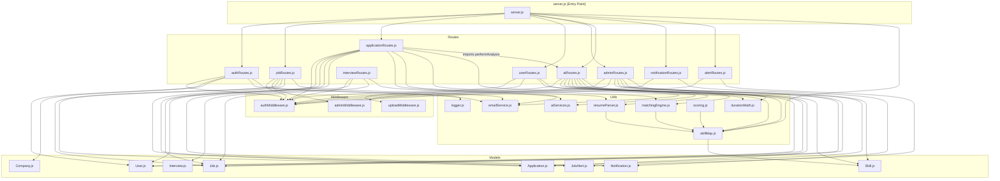
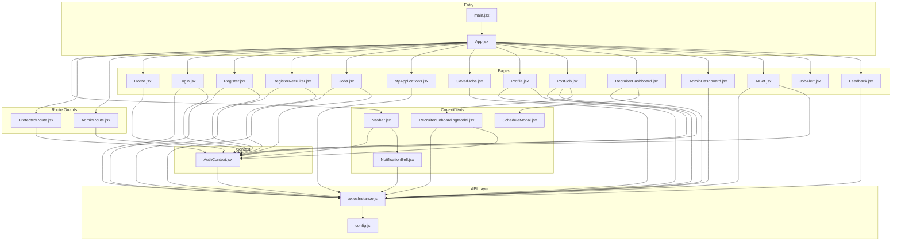

# 🗺️ Axon Hire — Codebase Mind Map & Impact Reference

> **Purpose:** Before touching any file, scan this document. Find the file in the Impact Matrix to see exactly which other files will be affected by your change. After every commit, this document is automatically re-generated by the GitHub Actions workflow.

---

## 📐 Architecture Overview

```
┌─────────────────────────────────────────────────────────────────┐
│                        BROWSER (React + Vite)                   │
│  frontend/src/                                                   │
│  ┌──────────┐  ┌─────────────┐  ┌─────────────────────────┐    │
│  │ AuthContext│  │ axiosInstance│  │  React Router Routes    │    │
│  └────┬─────┘  └──────┬──────┘  └────────────┬────────────┘    │
│       │                │                       │                 │
│  ┌────▼────────────────▼───────────────────────▼──────────────┐ │
│  │                     Pages + Components                      │ │
│  └────────────────────────────────┬────────────────────────────┘ │
└───────────────────────────────────┼─────────────────────────────┘
                                    │  HTTPS / JSON
┌───────────────────────────────────▼─────────────────────────────┐
│                    BACKEND (Node.js + Express)                   │
│  backend/server.js                                               │
│  ┌──────────────────────────────────────────────────────────┐   │
│  │  Rate Limiter → CORS → Helmet → Morgan → Routes          │   │
│  └──────────────────────────────────────────────────────────┘   │
│                                                                  │
│  Routes           Middleware        Utils          Models        │
│  ┌──────────┐    ┌────────────┐   ┌──────────┐   ┌──────────┐  │
│  │authRoutes│    │authMW (JWT)│   │aiServices│   │User      │  │
│  │jobRoutes │◄──►│adminMW     │   │skillMap  │   │Job       │  │
│  │appRoutes │    │uploadMW    │   │matchingEn│   │Application│ │
│  │userRoutes│    └────────────┘   │resumePars│   │Company   │  │
│  │adminRts  │                     │emailSvc  │   │Skill     │  │
│  │aiRoutes  │                     │durationMt│   │Notification│ │
│  │notifRts  │                     │scoring   │   │JobAlert  │  │
│  │alertRts  │                     │logger    │   │Interview │  │
│  └──────────┘                     └──────────┘   └──────────┘  │
└──────────────────────────────────────────────────────────────────┘
                                    │
┌───────────────────────────────────▼─────────────────────────────┐
│                         MongoDB Atlas                            │
│  Collections: users, jobs, applications, companies, skills,     │
│               notifications, jobalerts, interviews               │
└──────────────────────────────────────────────────────────────────┘
```

---

## 🔗 Backend Dependency Graph



---

## 🎨 Frontend Dependency Graph



---

## 🌐 API Endpoints ↔ Frontend Wiring

| API Endpoint | HTTP | Backend File | Frontend Caller |
|---|---|---|---|
| `/api/auth/register` | POST | `authRoutes.js` | `Register.jsx` |
| `/api/auth/verify-otp` | POST | `authRoutes.js` | `Register.jsx`, `RegisterRecruiter.jsx` |
| `/api/auth/login` | POST | `authRoutes.js` | `Login.jsx` |
| `/api/auth/google` | POST | `authRoutes.js` | `Login.jsx` |
| `/api/auth/register-recruiter` | POST | `authRoutes.js` | `RegisterRecruiter.jsx` |
| `/api/auth/onboard-recruiter` | PUT | `authRoutes.js` | `RecruiterOnboardingModal.jsx` |
| `/api/jobs` | GET | `jobRoutes.js` | `Jobs.jsx` |
| `/api/jobs` | POST | `jobRoutes.js` | `PostJob.jsx` |
| `/api/jobs/my-jobs` | GET | `jobRoutes.js` | `RecruiterDashboard.jsx` |
| `/api/jobs/:id` | DELETE | `jobRoutes.js` | `RecruiterDashboard.jsx` |
| `/api/jobs/:id/toggle` | PATCH | `jobRoutes.js` | `RecruiterDashboard.jsx` |
| `/api/applications/:jobId/apply` | POST | `applicationRoutes.js` | `Jobs.jsx` |
| `/api/applications/my-applications` | GET | `applicationRoutes.js` | `MyApplications.jsx`, `Jobs.jsx` |
| `/api/applications/recruiter` | GET | `applicationRoutes.js` | `RecruiterDashboard.jsx` |
| `/api/applications/:id/status` | PUT | `applicationRoutes.js` | `RecruiterDashboard.jsx` |
| `/api/applications/:id/schedule` | POST | `applicationRoutes.js` | `RecruiterDashboard.jsx` |
| `/api/users/profile` | GET | `userRoutes.js` | `Profile.jsx` |
| `/api/users/update-profile` | PUT | `userRoutes.js` | `Profile.jsx` |
| `/api/users/upload-avatar` | POST | `userRoutes.js` | `Profile.jsx` |
| `/api/users/upload-resume` | POST | `userRoutes.js` | `Profile.jsx` |
| `/api/users/save/:jobId` | PUT | `userRoutes.js` | `Jobs.jsx`, `SavedJobs.jsx` |
| `/api/users/saved-jobs` | GET | `userRoutes.js` | `Jobs.jsx`, `SavedJobs.jsx` |
| `/api/users/feedback` | POST | `userRoutes.js` | `Feedback.jsx` |
| `/api/notifications` | GET | `notificationRoutes.js` | `NotificationBell.jsx` |
| `/api/notifications/:id/read` | PUT | `notificationRoutes.js` | `NotificationBell.jsx` |
| `/api/notifications/read-all` | PUT | `notificationRoutes.js` | `NotificationBell.jsx` |
| `/api/alerts/subscribe` | POST | `alertRoutes.js` | `Jobs.jsx`, `JobAlert.jsx` |
| `/api/ai/analyze` | POST | `aiRoutes.js` | `RecruiterDashboard.jsx` |
| `/api/ai/analyze-v3` | POST | `aiRoutes.js` | (internal via `applicationRoutes.js`) |
| `/api/ai/evaluate-myself` | POST | `aiRoutes.js` | `Profile.jsx` |
| `/api/ai/generate-questions` | POST | `aiRoutes.js` | `AIBot.jsx` |
| `/api/ai/generate-questions-stream` | POST | `aiRoutes.js` | `AIBot.jsx` |
| `/api/admin/stats` | GET | `adminRoutes.js` | `AdminDashboard.jsx` |
| `/api/admin/users` | GET | `adminRoutes.js` | `AdminDashboard.jsx` |
| `/api/admin/users/:id` | DELETE | `adminRoutes.js` | `AdminDashboard.jsx` |
| `/api/admin/users/:id/role` | PUT | `adminRoutes.js` | `AdminDashboard.jsx` |
| `/api/admin/jobs` | GET | `adminRoutes.js` | `AdminDashboard.jsx` |
| `/api/admin/jobs/:id` | DELETE | `adminRoutes.js` | `AdminDashboard.jsx` |
| `/api/admin/applications` | GET | `adminRoutes.js` | `AdminDashboard.jsx` |
| `/api/admin/skills` | GET | `adminRoutes.js` | `AdminDashboard.jsx` |
| `/api/admin/skills/:id/approve` | PATCH | `adminRoutes.js` | `AdminDashboard.jsx` |

---

## 🗄️ Database Model Relationships

```
User ──────────────────────────────────────────────────────────────
  ├── Job (postedBy → User._id)
  ├── Application (applicantId → User._id)
  ├── Company (recruiter → User._id)
  ├── Notification (user → User._id)
  ├── JobAlert (userId → User._id)
  ├── Interview (candidateId → User._id)
  └── User.savedJobs → [Job._id]

Job ────────────────────────────────────────────────────────────────
  ├── Application (jobId → Job._id)
  ├── Interview (jobId → Job._id)
  └── Job.shortlisted → [{ candidateId → User._id }]

Application ────────────────────────────────────────────────────────
  ├── applicantId → User._id
  └── jobId → Job._id

Skill ──────────────────────────────────────────────────────────────
  └── Used by skillMap.js cache (in-memory lookup, not DB ref)
```

---

## 🤖 AI / Scoring Pipeline

```
Candidate applies (Jobs.jsx)
        │
        ▼
POST /api/applications/:jobId/apply (applicationRoutes.js)
        │
        ├─── Instant: calculateV3Score() ◄── matchingEngine.js ◄── skillMap.js
        │                                                       ◄── durationMath.js
        │
        └─── Background: performAnalysis() ◄── aiRoutes.js
                    │
                    ├── parseResumeFromUrl() ◄── resumeParser.js ◄── skillMap.js
                    └── Multi-model carousel ◄── aiServices.js
                              ├── OpenRouter (Mistral 7B)  ← attempt 1
                              ├── Groq (LLaMA 3.3)         ← fallback
                              └── Gemini 2.5 Flash          ← final fallback
```

---

## 🔐 Authentication Flow

```
Register.jsx ──► POST /api/auth/register ──► User.js (pending)
                         │
                         └──► emailService.js (OTP email)
                                    │
Register.jsx ──► POST /api/auth/verify-otp ──► User.js (active)
                         │
                         └──► JWT token returned
                                    │
                    stored in AuthContext.jsx (localStorage)
                                    │
All protected routes ──► ProtectedRoute.jsx ──► AuthContext.jsx
                                    │
All API calls ──► axiosInstance.js ──► Authorization: Bearer <token>
                                    │
                    ──► authMiddleware.js (verifies JWT)
                                    │
Admin-only routes ──► adminMiddleware.js (checks req.user.role)
```

---

<!-- AUTO:IMPACT_MATRIX:START -->
## ⚡ Impact Matrix — Auto-Generated

> **How to use:** Find the file you are about to change in the left column. The right column lists every file that imports it (direct impact). Check all those files after your change.

| File You Change | Direct Importers (will be affected) |
|---|---|
| `frontend/src/api/axiosInstance.js` | `frontend/src/api/interviewApi.js`, `frontend/src/components/NotificationBell.jsx`, `frontend/src/components/RecruiterOnboardingModal.jsx`, `frontend/src/context/AuthContext.jsx`, `frontend/src/pages/AIBot.jsx`, `frontend/src/pages/AdminDashboard.jsx`, `frontend/src/pages/Feedback.jsx`, `frontend/src/pages/Jobs.jsx`, `frontend/src/pages/Login.jsx`, `frontend/src/pages/MyApplications.jsx`, `frontend/src/pages/PostJob.jsx`, `frontend/src/pages/Profile.jsx`, `frontend/src/pages/RecruiterDashboard.jsx`, `frontend/src/pages/Register.jsx`, `frontend/src/pages/RegisterRecruiter.jsx`, `frontend/src/pages/SavedJobs.jsx` |
| `frontend/src/context/AuthContext.jsx` | `frontend/src/components/Navbar.jsx`, `frontend/src/components/RecruiterOnboardingModal.jsx`, `frontend/src/main.jsx`, `frontend/src/pages/AIBot.jsx`, `frontend/src/pages/Home.jsx`, `frontend/src/pages/Jobs.jsx`, `frontend/src/pages/Login.jsx`, `frontend/src/pages/PostJob.jsx`, `frontend/src/pages/Profile.jsx`, `frontend/src/pages/Register.jsx`, `frontend/src/pages/RegisterRecruiter.jsx`, `frontend/src/routes/AdminRoute.jsx`, `frontend/src/routes/ProtectedRoute.jsx` |
| `backend/middleware/authMiddleware.js` | `backend/routes/adminRoutes.js`, `backend/routes/aiRoutes.js`, `backend/routes/alertRoutes.js`, `backend/routes/applicationRoutes.js`, `backend/routes/authRoutes.js`, `backend/routes/interviewRoutes.js`, `backend/routes/jobRoutes.js`, `backend/routes/notificationRoutes.js`, `backend/routes/userRoutes.js`, `backend/server.js` |
| `backend/models/Job.js` | `backend/routes/adminRoutes.js`, `backend/routes/aiRoutes.js`, `backend/routes/applicationRoutes.js`, `backend/routes/interviewRoutes.js`, `backend/routes/jobRoutes.js`, `frontend/src/api/interviewApi.js` |
| `backend/utils/skillMap.js` | `backend/routes/adminRoutes.js`, `backend/routes/aiRoutes.js`, `backend/server.js`, `backend/utils/matchingEngine.js`, `backend/utils/resumeParser.js`, `backend/utils/scoring.js` |
| `backend/models/Application.js` | `backend/routes/adminRoutes.js`, `backend/routes/aiRoutes.js`, `backend/routes/applicationRoutes.js`, `backend/routes/jobRoutes.js` |
| `backend/models/User.js` | `backend/routes/adminRoutes.js`, `backend/routes/applicationRoutes.js`, `backend/routes/authRoutes.js`, `backend/routes/userRoutes.js` |
| `backend/utils/logger.js` | `backend/routes/aiRoutes.js`, `backend/routes/authRoutes.js`, `backend/routes/jobRoutes.js`, `backend/server.js` |
| `frontend/src/hooks/useDebounce.js` | `frontend/src/pages/AdminDashboard.jsx`, `frontend/src/pages/Jobs.jsx`, `frontend/src/pages/MyApplications.jsx`, `frontend/src/pages/SavedJobs.jsx` |
| `backend/models/Notification.js` | `backend/routes/applicationRoutes.js`, `backend/routes/jobRoutes.js`, `backend/routes/notificationRoutes.js` |
| `backend/models/Skill.js` | `backend/routes/adminRoutes.js`, `backend/routes/aiRoutes.js`, `backend/utils/skillMap.js` |
| `backend/utils/emailService.js` | `backend/routes/applicationRoutes.js`, `backend/routes/authRoutes.js`, `backend/routes/userRoutes.js` |
| `backend/models/Interview.js` | `backend/routes/interviewRoutes.js`, `frontend/src/api/interviewApi.js` |
| `backend/models/JobAlert.js` | `backend/routes/alertRoutes.js`, `backend/routes/jobRoutes.js` |
| `backend/routes/aiRoutes.js` | `backend/routes/applicationRoutes.js`, `backend/server.js` |
| `backend/utils/aiServices.js` | `backend/routes/aiRoutes.js`, `backend/routes/interviewRoutes.js` |
| `backend/utils/durationMath.js` | `backend/routes/aiRoutes.js`, `backend/routes/applicationRoutes.js` |
| `backend/utils/matchingEngine.js` | `backend/routes/aiRoutes.js`, `backend/routes/applicationRoutes.js` |
| `backend/utils/resumeParser.js` | `backend/routes/aiRoutes.js`, `backend/routes/applicationRoutes.js` |
| `frontend/src/api/config.js` | `frontend/src/api/axiosInstance.js`, `frontend/src/pages/AIBot.jsx` |
| `backend/middleware/adminMiddleware.js` | `backend/routes/jobRoutes.js` |
| `backend/middleware/uploadMiddleware.js` | `backend/routes/userRoutes.js` |
| `backend/models/Company.js` | `backend/routes/authRoutes.js` |
| `backend/routes/adminRoutes.js` | `backend/server.js` |
| `backend/routes/alertRoutes.js` | `backend/server.js` |
| `backend/routes/applicationRoutes.js` | `backend/server.js` |
| `backend/routes/authRoutes.js` | `backend/server.js` |
| `backend/routes/interviewRoutes.js` | `backend/server.js` |
| `backend/routes/jobRoutes.js` | `backend/server.js` |
| `backend/routes/notificationRoutes.js` | `backend/server.js` |
| `backend/routes/userRoutes.js` | `backend/server.js` |
| `frontend/src/App.jsx` | `frontend/src/main.jsx` |
| `frontend/src/components/Navbar.jsx` | `frontend/src/App.jsx` |
| `frontend/src/components/NotificationBell.jsx` | `frontend/src/components/Navbar.jsx` |
| `frontend/src/components/RecruiterOnboardingModal.jsx` | `frontend/src/pages/PostJob.jsx` |
| `frontend/src/components/ScheduleModal.jsx` | `frontend/src/pages/RecruiterDashboard.jsx` |
| `frontend/src/pages/AdminDashboard.jsx` | `frontend/src/App.jsx` |
| `frontend/src/pages/AIBot.jsx` | `frontend/src/App.jsx` |
| `frontend/src/pages/Feedback.jsx` | `frontend/src/App.jsx` |
| `frontend/src/pages/Home.jsx` | `frontend/src/App.jsx` |
| `frontend/src/pages/Jobs.jsx` | `frontend/src/App.jsx` |
| `frontend/src/pages/Login.jsx` | `frontend/src/App.jsx` |
| `frontend/src/pages/MyApplications.jsx` | `frontend/src/App.jsx` |
| `frontend/src/pages/PostJob.jsx` | `frontend/src/App.jsx` |
| `frontend/src/pages/Profile.jsx` | `frontend/src/App.jsx` |
| `frontend/src/pages/RecruiterDashboard.jsx` | `frontend/src/App.jsx` |
| `frontend/src/pages/Register.jsx` | `frontend/src/App.jsx` |
| `frontend/src/pages/RegisterRecruiter.jsx` | `frontend/src/App.jsx` |
| `frontend/src/pages/SavedJobs.jsx` | `frontend/src/App.jsx` |
| `frontend/src/routes/AdminRoute.jsx` | `frontend/src/App.jsx` |
| `frontend/src/routes/ProtectedRoute.jsx` | `frontend/src/App.jsx` |
| `backend/jest.config.js` | _(entry point or not imported by any tracked file)_ |
| `backend/server.js` | _(entry point or not imported by any tracked file)_ |
| `backend/utils/scoring.js` | _(entry point or not imported by any tracked file)_ |
| `frontend/src/api/interviewApi.js` | _(entry point or not imported by any tracked file)_ |
| `frontend/src/main.jsx` | _(entry point or not imported by any tracked file)_ |
| `frontend/src/pages/JobAlert.jsx` | _(entry point or not imported by any tracked file)_ |
| `frontend/src/pages/VerifyOTP.jsx` | _(entry point or not imported by any tracked file)_ |
<!-- AUTO:IMPACT_MATRIX:END -->

---

<!-- AUTO:DEP_MAP:START -->
## 📁 Full Dependency Map — Auto-Generated

> Each file lists its local imports (relative require/import). Generated from static analysis.

### Backend

| File | Local Imports |
|---|---|
| `backend/jest.config.js` | _(no local imports)_ |
| `backend/middleware/adminMiddleware.js` | _(no local imports)_ |
| `backend/middleware/authMiddleware.js` | _(no local imports)_ |
| `backend/middleware/uploadMiddleware.js` | _(no local imports)_ |
| `backend/models/Application.js` | _(no local imports)_ |
| `backend/models/Company.js` | _(no local imports)_ |
| `backend/models/Interview.js` | _(no local imports)_ |
| `backend/models/Job.js` | _(no local imports)_ |
| `backend/models/JobAlert.js` | _(no local imports)_ |
| `backend/models/Notification.js` | _(no local imports)_ |
| `backend/models/Skill.js` | _(no local imports)_ |
| `backend/models/User.js` | _(no local imports)_ |
| `backend/routes/adminRoutes.js` | `backend/middleware/authMiddleware.js`, `backend/models/Application.js`, `backend/models/Job.js`, `backend/models/Skill.js`, `backend/models/User.js`, `backend/utils/skillMap.js` |
| `backend/routes/aiRoutes.js` | `backend/middleware/authMiddleware.js`, `backend/models/Application.js`, `backend/models/Job.js`, `backend/models/Skill.js`, `backend/utils/aiServices.js`, `backend/utils/durationMath.js`, `backend/utils/logger.js`, `backend/utils/matchingEngine.js`, `backend/utils/resumeParser.js`, `backend/utils/skillMap.js` |
| `backend/routes/alertRoutes.js` | `backend/middleware/authMiddleware.js`, `backend/models/JobAlert.js` |
| `backend/routes/applicationRoutes.js` | `backend/middleware/authMiddleware.js`, `backend/models/Application.js`, `backend/models/Job.js`, `backend/models/Notification.js`, `backend/models/User.js`, `backend/routes/aiRoutes.js`, `backend/utils/durationMath.js`, `backend/utils/emailService.js`, `backend/utils/matchingEngine.js`, `backend/utils/resumeParser.js` |
| `backend/routes/authRoutes.js` | `backend/middleware/authMiddleware.js`, `backend/models/Company.js`, `backend/models/User.js`, `backend/utils/emailService.js`, `backend/utils/logger.js` |
| `backend/routes/interviewRoutes.js` | `backend/middleware/authMiddleware.js`, `backend/models/Interview.js`, `backend/models/Job.js`, `backend/utils/aiServices.js` |
| `backend/routes/jobRoutes.js` | `backend/middleware/adminMiddleware.js`, `backend/middleware/authMiddleware.js`, `backend/models/Application.js`, `backend/models/Job.js`, `backend/models/JobAlert.js`, `backend/models/Notification.js`, `backend/utils/logger.js` |
| `backend/routes/notificationRoutes.js` | `backend/middleware/authMiddleware.js`, `backend/models/Notification.js` |
| `backend/routes/userRoutes.js` | `backend/middleware/authMiddleware.js`, `backend/middleware/uploadMiddleware.js`, `backend/models/User.js`, `backend/utils/emailService.js` |
| `backend/server.js` | `backend/middleware/authMiddleware.js`, `backend/routes/adminRoutes.js`, `backend/routes/aiRoutes.js`, `backend/routes/alertRoutes.js`, `backend/routes/applicationRoutes.js`, `backend/routes/authRoutes.js`, `backend/routes/interviewRoutes.js`, `backend/routes/jobRoutes.js`, `backend/routes/notificationRoutes.js`, `backend/routes/userRoutes.js`, `backend/utils/logger.js`, `backend/utils/skillMap.js` |
| `backend/utils/aiServices.js` | _(no local imports)_ |
| `backend/utils/durationMath.js` | _(no local imports)_ |
| `backend/utils/emailService.js` | _(no local imports)_ |
| `backend/utils/logger.js` | _(no local imports)_ |
| `backend/utils/matchingEngine.js` | `backend/utils/skillMap.js` |
| `backend/utils/resumeParser.js` | `backend/utils/skillMap.js` |
| `backend/utils/scoring.js` | `backend/utils/skillMap.js` |
| `backend/utils/skillMap.js` | `backend/models/Skill.js` |

### Frontend

| File | Local Imports |
|---|---|
| `frontend/src/api/axiosInstance.js` | `frontend/src/api/config.js` |
| `frontend/src/api/config.js` | _(no local imports)_ |
| `frontend/src/api/interviewApi.js` | `backend/models/Interview.js`, `backend/models/Job.js`, `frontend/src/api/axiosInstance.js` |
| `frontend/src/App.jsx` | `frontend/src/components/Navbar.jsx`, `frontend/src/pages/AIBot.jsx`, `frontend/src/pages/AdminDashboard.jsx`, `frontend/src/pages/Feedback.jsx`, `frontend/src/pages/Home.jsx`, `frontend/src/pages/Jobs.jsx`, `frontend/src/pages/Login.jsx`, `frontend/src/pages/MyApplications.jsx`, `frontend/src/pages/PostJob.jsx`, `frontend/src/pages/Profile.jsx`, `frontend/src/pages/RecruiterDashboard.jsx`, `frontend/src/pages/Register.jsx`, `frontend/src/pages/RegisterRecruiter.jsx`, `frontend/src/pages/SavedJobs.jsx`, `frontend/src/routes/AdminRoute.jsx`, `frontend/src/routes/ProtectedRoute.jsx` |
| `frontend/src/components/Navbar.jsx` | `frontend/src/components/NotificationBell.jsx`, `frontend/src/context/AuthContext.jsx` |
| `frontend/src/components/NotificationBell.jsx` | `frontend/src/api/axiosInstance.js` |
| `frontend/src/components/RecruiterOnboardingModal.jsx` | `frontend/src/api/axiosInstance.js`, `frontend/src/context/AuthContext.jsx` |
| `frontend/src/components/ScheduleModal.jsx` | _(no local imports)_ |
| `frontend/src/context/AuthContext.jsx` | `frontend/src/api/axiosInstance.js` |
| `frontend/src/hooks/useDebounce.js` | _(no local imports)_ |
| `frontend/src/main.jsx` | `frontend/src/App.jsx`, `frontend/src/context/AuthContext.jsx` |
| `frontend/src/pages/AdminDashboard.jsx` | `frontend/src/api/axiosInstance.js`, `frontend/src/hooks/useDebounce.js` |
| `frontend/src/pages/AIBot.jsx` | `frontend/src/api/axiosInstance.js`, `frontend/src/api/config.js`, `frontend/src/context/AuthContext.jsx` |
| `frontend/src/pages/Feedback.jsx` | `frontend/src/api/axiosInstance.js` |
| `frontend/src/pages/Home.jsx` | `frontend/src/context/AuthContext.jsx` |
| `frontend/src/pages/JobAlert.jsx` | _(no local imports)_ |
| `frontend/src/pages/Jobs.jsx` | `frontend/src/api/axiosInstance.js`, `frontend/src/context/AuthContext.jsx`, `frontend/src/hooks/useDebounce.js` |
| `frontend/src/pages/Login.jsx` | `frontend/src/api/axiosInstance.js`, `frontend/src/context/AuthContext.jsx` |
| `frontend/src/pages/MyApplications.jsx` | `frontend/src/api/axiosInstance.js`, `frontend/src/hooks/useDebounce.js` |
| `frontend/src/pages/PostJob.jsx` | `frontend/src/api/axiosInstance.js`, `frontend/src/components/RecruiterOnboardingModal.jsx`, `frontend/src/context/AuthContext.jsx` |
| `frontend/src/pages/Profile.jsx` | `frontend/src/api/axiosInstance.js`, `frontend/src/context/AuthContext.jsx` |
| `frontend/src/pages/RecruiterDashboard.jsx` | `frontend/src/api/axiosInstance.js`, `frontend/src/components/ScheduleModal.jsx` |
| `frontend/src/pages/Register.jsx` | `frontend/src/api/axiosInstance.js`, `frontend/src/context/AuthContext.jsx` |
| `frontend/src/pages/RegisterRecruiter.jsx` | `frontend/src/api/axiosInstance.js`, `frontend/src/context/AuthContext.jsx` |
| `frontend/src/pages/SavedJobs.jsx` | `frontend/src/api/axiosInstance.js`, `frontend/src/hooks/useDebounce.js` |
| `frontend/src/pages/VerifyOTP.jsx` | _(no local imports)_ |
| `frontend/src/routes/AdminRoute.jsx` | `frontend/src/context/AuthContext.jsx` |
| `frontend/src/routes/ProtectedRoute.jsx` | `frontend/src/context/AuthContext.jsx` |
<!-- AUTO:DEP_MAP:END -->

---

## 🚨 High-Risk Change Zones

These areas affect the most files. Extra care required:

| Risk Level | File | Why It's High Risk |
|---|---|---|
| 🔴 CRITICAL | `backend/utils/skillMap.js` | Powers all AI scoring — used by 6 files. Cache corruption breaks all scoring. |
| 🔴 CRITICAL | `backend/middleware/authMiddleware.js` | Used by every single route. Breaking it logs out all users. |
| 🔴 CRITICAL | `frontend/src/api/axiosInstance.js` | Used by every page/component that calls the API. |
| 🔴 CRITICAL | `frontend/src/context/AuthContext.jsx` | Provides auth state to all protected pages and guards. |
| 🟠 HIGH | `backend/routes/applicationRoutes.js` | Core job-apply flow. Imports from `aiRoutes` — circular concern. |
| 🟠 HIGH | `backend/utils/matchingEngine.js` | Scoring logic. Changes break AI evaluation for all applications. |
| 🟠 HIGH | `backend/utils/emailService.js` | Used by 4 routes for OTP, welcome, status updates, interviews. |
| 🟡 MEDIUM | `backend/models/User.js` | Schema changes need migration; affects auth, profile, applications. |
| 🟡 MEDIUM | `backend/models/Job.js` | Schema changes affect job listing, applications, recruiter dashboard. |
| 🟡 MEDIUM | `backend/models/Application.js` | Schema changes affect apply flow, recruiter view, AI scoring storage. |
| 🟢 LOW | `backend/routes/interviewRoutes.js` | Currently commented out in `server.js` — not mounted. |
| 🟢 LOW | `backend/utils/scoring.js` | Not imported anywhere currently. |
| 🔴 CRITICAL | `frontend/src/api/interviewApi.js` | ⚠️ **Pre-existing bug**: imports backend Mongoose models directly (`../../../backend/models/Interview.js`, `../../../backend/models/Job.js`). These will fail in a browser — frontend must only call API endpoints, not require Node/Mongoose modules. |
| 🟢 LOW | `frontend/src/pages/JobAlert.jsx` | Uses raw `fetch` to hardcoded localhost — isolated from axiosInstance. |

---

<!-- AUTO:TIMESTAMP:START -->
## 🕐 Last Auto-Updated

**Date:** 2026-04-06T18:55:50.199Z  
**Commit:** `97642892`  
**Message:** fix: typo analyse→analyze in script, document pre-existing interviewApi cross-boundary import bug  
**Branch:** copilot/create-mindmap-for-code-references
<!-- AUTO:TIMESTAMP:END -->
